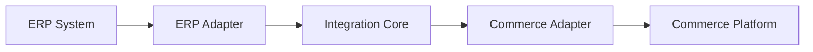
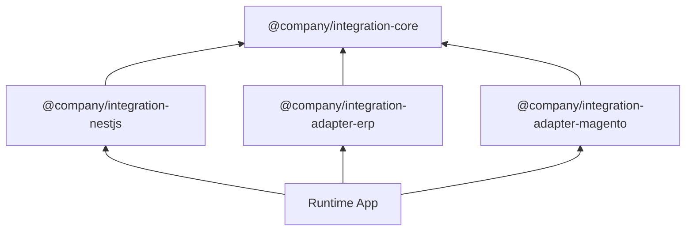

# ERP ↔ Commerce Integration Platform

A modular TypeScript integration platform for synchronizing data between ERP systems and Commerce platforms.

The project is built around a pragmatic ports-and-adapters architecture.

The main goals are:

- keep core integration logic framework-independent;
- keep NestJS-specific wiring outside the core package;
- keep ERP and Commerce integrations as separate installable adapters;
- keep use cases generic and independent from specific providers;
- allow adapters to be moved into separate services or pods later.

---

## Architecture Overview



Example runtime composition:

```text
ERP Adapter → Integration Core → Magento Adapter
```

The core package does not know anything about:

- Magento;
- Shopify;
- SAP;
- Odoo;
- NestJS;
- HTTP clients;
- queues;
- database implementations.

All provider-specific and infrastructure-specific code must live outside the core package.

---

## Packages

```text
packages/
  integration-core/
  integration-nestjs/
  integration-adapter-magento/
  integration-adapter-erp/
```

---

## Package Responsibilities

### `@company/integration-core`

Framework-independent TypeScript package.

This is the application core.

Contains:

```text
models/
commands/
ports/
use-cases/
services/
errors/
tokens.ts
index.ts
```

Responsibilities:

- define canonical models;
- define sync commands;
- define ports/interfaces;
- provide generic sync use cases;
- provide common application services;
- provide shared errors and tokens.

Allowed:

- plain TypeScript classes;
- interfaces;
- types;
- enums;
- provider-independent orchestration logic.

Forbidden:

- `@nestjs/*` imports;
- NestJS decorators;
- controllers;
- modules;
- Magento-specific code;
- ERP-specific code;
- HTTP clients;
- database implementations;
- queue implementations.

Example use cases:

```text
SyncErpProductsToCommerceUseCase
SyncErpInventoryToCommerceUseCase
SyncCommerceOrdersToErpUseCase
```

---

### `@company/integration-nestjs`

NestJS binding package.

This package connects `integration-core` to NestJS DI.

Contains:

```text
integration.module.ts
use-case.providers.ts
port-tokens.ts
index.ts
```

Responsibilities:

- register core use cases as NestJS providers;
- expose `IntegrationModule`;
- bind core ports to NestJS tokens;
- keep NestJS-specific wiring outside the core.

Forbidden:

- Magento API logic;
- ERP API logic;
- provider-specific mapping;
- sync business logic.

---

### `@company/integration-adapter-magento`

Magento adapter package.

Contains Magento-specific implementation.

Contains:

```text
client/
mapper/
adapter/
magento-adapter.module.ts
index.ts
```

Responsibilities:

- communicate with Magento API;
- map Magento payloads to and from core models;
- implement Commerce ports from `integration-core`;
- optionally expose a NestJS module for provider registration.

Implements:

```text
CommercePort
```

---

### `@company/integration-adapter-erp`

ERP adapter package.

Contains ERP-specific implementation.

Contains:

```text
client/
mapper/
adapter/
erp-adapter.module.ts
index.ts
```

Responsibilities:

- communicate with the ERP API;
- map ERP payloads to and from core models;
- implement ERP ports from `integration-core`;
- optionally expose a NestJS module for provider registration.

Implements:

```text
ErpPort
```

---

## Dependency Direction

Dependencies must point inward to the core.



Allowed dependencies:

```text
integration-nestjs -> integration-core

integration-adapter-magento -> integration-core
integration-adapter-erp -> integration-core

adapter NestJS modules -> integration-nestjs

runtime app -> integration-core
runtime app -> integration-nestjs
runtime app -> integration-adapter-*
```

Forbidden dependencies:

```text
integration-core -> @nestjs/*
integration-core -> integration-adapter-*
integration-core -> external API clients
integration-core -> database implementations
integration-core -> queue implementations

integration-nestjs -> integration-adapter-*
```

---

## Core Design Rules

### 1. Use cases are generic

Good:

```text
SyncErpProductsToCommerceUseCase
SyncErpInventoryToCommerceUseCase
SyncCommerceOrdersToErpUseCase
```

Bad:

```text
SyncMagentoInventoryUseCase
SyncSapProductsToMagentoUseCase
SyncEverythingUseCase
```

Use cases must describe a sync flow, not a specific provider.

---

### 2. Use cases depend only on ports

Example:

```ts
export class SyncErpInventoryToCommerceUseCase {
  constructor(
    private readonly erpPort: ErpPort,
    private readonly commercePort: CommercePort,
    private readonly syncLogPort: SyncLogPort,
  ) {}

  async execute(command: SyncInventoryCommand): Promise<void> {
    await this.syncLogPort.started(command.syncId, 'erp_inventory_to_commerce');

    try {
      const inventory = await this.erpPort.getInventory(command);

      await this.commercePort.updateInventory(inventory);

      await this.syncLogPort.success(command.syncId);
    } catch (error) {
      await this.syncLogPort.failed(command.syncId, error);
      throw error;
    }
  }
}
```

---

### 3. Adapters implement ports

Magento adapter implements Commerce-side behavior:

```ts
export class MagentoCommerceAdapter implements CommercePort {
  async updateProducts(products: Product[]): Promise<void> {
    // map Product[] to Magento payload
    // call Magento API
  }

  async updateInventory(items: InventoryItem[]): Promise<void> {
    // map InventoryItem[] to Magento payload
    // call Magento API
  }

  async getOrders(command: SyncOrdersCommand): Promise<Order[]> {
    // call Magento API
    // map Magento orders to Order[]
    return [];
  }
}
```

ERP adapter implements ERP-side behavior:

```ts
export class ErpAdapter implements ErpPort {
  async getProducts(command: SyncProductsCommand): Promise<Product[]> {
    // call ERP API
    // map ERP products to Product[]
    return [];
  }

  async getInventory(command: SyncInventoryCommand): Promise<InventoryItem[]> {
    // call ERP API
    // map ERP inventory to InventoryItem[]
    return [];
  }

  async createOrder(order: Order): Promise<{ externalId: string }> {
    // map Order to ERP payload
    // call ERP API
    return { externalId: 'placeholder' };
  }
}
```

---

## Runtime Composition

The runtime app composes the core, NestJS binding, and selected adapters.

Example:

```ts
import { Module } from '@nestjs/common';
import { IntegrationModule } from '@company/integration-nestjs';
import { MagentoAdapterModule } from '@company/integration-adapter-magento';
import { ErpAdapterModule } from '@company/integration-adapter-erp';

@Module({
  imports: [
    IntegrationModule.forRoot(),
    MagentoAdapterModule.forRoot(),
    ErpAdapterModule.forRoot(),
  ],
})
export class AppModule {}
```

The runtime app is responsible for:

- importing modules;
- providing configuration;
- starting HTTP server or worker;
- connecting queues or schedulers if needed;
- composing concrete adapters with core use cases.

The runtime app should not contain provider-specific sync logic.

---

## Example Sync Flows

### ERP Products to Commerce

```text
SyncErpProductsToCommerceUseCase
  -> ErpPort.getProducts()
  -> CommercePort.updateProducts()
  -> SyncLogPort.success()
```

### ERP Inventory to Commerce

```text
SyncErpInventoryToCommerceUseCase
  -> ErpPort.getInventory()
  -> CommercePort.updateInventory()
  -> SyncLogPort.success()
```

### Commerce Orders to ERP

```text
SyncCommerceOrdersToErpUseCase
  -> CommercePort.getOrders()
  -> IdempotencyPort.isProcessed()
  -> ErpPort.createOrder()
  -> IdempotencyPort.markProcessed()
  -> SyncLogPort.success()
```

---

## Development Rules

1. Keep `integration-core` framework-independent.
2. Do not import `@nestjs/*` inside `integration-core`.
3. Do not import adapter packages inside `integration-core`.
4. Do not put Magento-specific code inside core use cases.
5. Do not put ERP-specific code inside core use cases.
6. Use ports for all external systems.
7. Keep adapters responsible for external APIs and mapping.
8. Keep use cases responsible for orchestration.
9. Keep runtime app responsible for wiring packages together.
10. Export public APIs only through `index.ts`.

---

## Workspace Layout

```text
packages/
  integration-core/
  integration-nestjs/
  integration-adapter-magento/
  integration-adapter-erp/

apps/
  integration-api/
```

Recommended `pnpm-workspace.yaml`:

```yaml
packages:
  - "packages/*"
  - "apps/*"
```

---

## Installation Example

For a runtime using Magento and ERP adapter:

```bash
pnpm add @company/integration-core
pnpm add @company/integration-nestjs
pnpm add @company/integration-adapter-magento
pnpm add @company/integration-adapter-erp
```

---

## Summary

```text
integration-core
  pure TypeScript application core

integration-nestjs
  NestJS DI binding for the core

integration-adapter-magento
  Magento-specific Commerce adapter

integration-adapter-erp
  ERP-specific adapter

runtime app
  composition root
```
